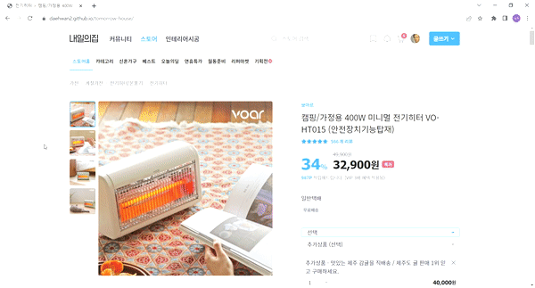

# 🏠내일의 집

- 오늘의 집 클론 코딩. (강좌)
- 사용한 기술 : html, scss, vanilla javascript

## 📙배운 것들

- scss 의 기본 사용법 및 문법
- 컴포넌트별로 작업하기
- figma 보고 그대로 작업하기
- Semantic Markup
- 의미있는 commit
- tiny-slider.js
- javascript - scroll event
- stylelint

<br/>

## 📋결과물

- Mobile

</img>

- Desktop

</img>

- URL: **https://daehwan2.github.io/tomorrow-house/**

<br/>
<br/>
<br/>

## 📖어쩔수없이 마크업을 따로 한 경우 정리

<br/>

### 1.GNB

- 로그인을 하지 않은 경우

```html
<div class="button-group">
  <button
    class="gnb-icon-button is-search lg-hidden"
    type="button"
    aria-label="검색창 열기 버튼"
  >
    <i class="ic-search"></i>
  </button>
  <a
    class="gnb-icon-button is-cart"
    href="/"
    aria-label="장바구니 페이지로 이동"
  >
    <i class="ic-cart"></i>
    <strong class="badge">5</strong>
  </a>
  <div class="gnb-auth sm-hidden">
    <a href="">로그인</a>
    <a href="">회원가입</a>
  </div>
</div>
```

- 로그인을 했을 경우

```html
<div class="button-group">
  <button
    class="gnb-icon-button is-search lg-hidden"
    type="button"
    aria-label="검색창 열기 버튼"
  >
    <i class="ic-search"></i>
  </button>
  <a
    href="/"
    class="gnb-icon-button sm-hidden"
    aria-label="스크랩북 페이지으로 이동"
  >
    <i class="ic-bookmark"></i>
  </a>

  <a
    href="/"
    class="gnb-icon-button sm-hidden"
    aria-label="내소식 페이지으로 이동"
  >
    <i class="ic-bell"></i>
  </a>

  <a
    class="gnb-icon-button is-cart"
    href="/"
    aria-label="장바구니 페이지로 이동"
  >
    <i class="ic-cart"></i>
    <strong class="badge">5</strong>
  </a>

  <button
    class="gnb-avatar-button sm-hidden"
    type="button"
    aria-label="마이메뉴 버튼"
  >
    <div class="avatar-32">
      
    </div>
  </button>
</div>
```

### 2. Sidebar

- 로그인을 하지 않은 경우

```html
<div class="sidebar-auth">
  <a class="btn-outlined btn-40" href="/">로그인</a>
  <a class="btn-primary btn-40" href="/">회원가입</a>
</div>
```

- 로그인을 했을 경우

```html
<div class="sidebar-user">
  <a href="/">
    <div class="avatar-24">
      
    </div>
    <strong class="username">사달라</strong>
  </a>
</div>
```

### 3. Product-Review

- 리뷰가 0개일 경우

```html
<section
  class="product-section product-review"
  id="product-review"
  role="tabpanel"
>
  <header class="product-section-header">
    <div>
      <h1 class="title">리뷰</h1>
      <strong class="badge" aria-label="0개">0</strong>
    </div>
    <a class="text-button" href="/">리뷰쓰기</a>
  </header>

  <div class="product-section-content">
    <p class="review-empty">
      첫 리뷰를 남겨주세요!<br />
      최대 <strong>500P</strong>를 드립니다.
    </p>
  </div>
</section>
<div class="product-section-divider sm-only" aria-hidden></div>
```

### 4. Product-inquiry

- 문의가 0개일 경우

```html
<section
  class="product-section product-inquiry is-open"
  id="product-inquiry"
  role="tabpanel"
>
  <header class="product-section-header">
    <div>
      <h1 class="title">문의</h1>
      <strong class="badge" aria-label="0개">0</strong>
    </div>
    <a class="text-button" href="/">문의하기</a>
    <button class="icon-button sm-only" type="button" aria-label="더보기">
      <i class="ic-chevron" aria-hidden></i>
    </button>
  </header>

  <div class="product-section-content">
    <p class="inquiry-empty">문의 내역이 없습니다.</p>
  </div>
</section>
<div class="product-section-divider sm-only" aria-hidden></div>
```

### 5. Bookmark-Toast

- 북마크에 추가했을때

```html
<aside class="bookmark-toast">
  <h1 class="bookmark-title">스크랩했습니다</h1>

  <button class="close-button" type="button" aria-label="닫기">
    <i class="ic-close" aria-hidden></i>
  </button>

  <div class="button-group">
    <a class="btn-32 btn-outlined" href="/">스크랩북 보기</a>
    <button class="btn-32 btn-primary" type="button">폴더에 담기</button>
  </div>
</aside>
```

- 북마크에서 삭제했을때

```html
<aside class="bookmark-toast">
  <h1 class="bookmark-title">스크랩에서 삭제했습니다</h1>

  <button class="close-button" type="button" aria-label="닫기">
    <i class="ic-close" aria-hidden></i>
  </button>
</aside>
```
